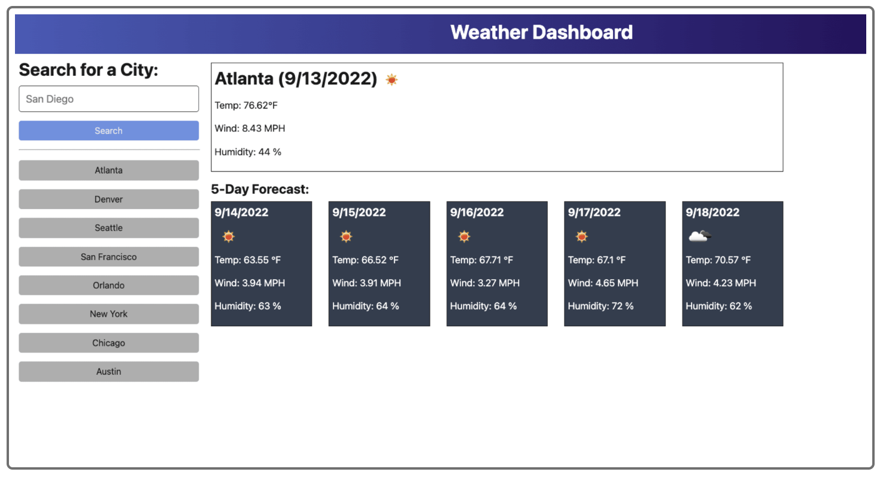
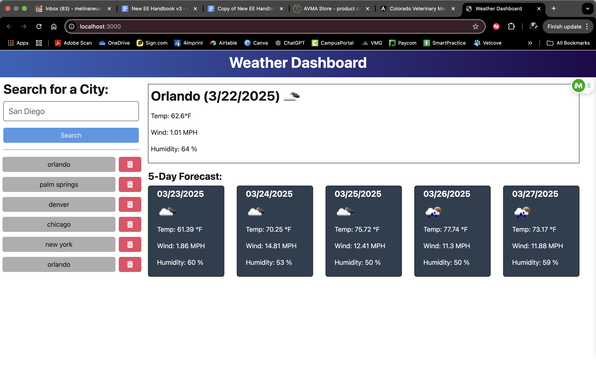

# Mod 9 Weather Web Application

## Description

This is a web application that allows users to view 5 days of weather information when given a city name.  This read me will guide you through the installation and usage of the application.

### Acceptance Criteria

- Front End starter code has been provided
- Open Weather API should be utilized for this project
- GIVEN a weather dashboard with form inputs
- WHEN I search for a city
THEN I am presented with current and future conditions for that city, and that city is added to the search history
- WHEN I view current weather conditions for that city
THEN I am presented with the city name, the date, an icon representation of weather conditions, a description of the weather for the icon's `alt` tag, the temperature, the humidity, and the wind speed
- WHEN I view future weather conditions for that city
THEN I am presented with a 5-day forecast that displays the date, an icon representation of weather conditions, the temperature, the wind speed, and the humidity
- WHEN I click on a city in the search history
THEN I am again presented with current and future conditions for that city
- Image below shows how the web application should appear if performed properly



## Table of Contents

- [Installation](#installation)
- [Usage](#usage)
- [License](#license)
- [Contributors](#contributors)
- [Tests](#tests)
- [Deployment](#deployment)
- [Questions](#questions)


## Installation

To install necessary dependencies, run the following command:

- `npm run install`
- `npm run build`
- `npm run start:dev`


## Usage

To use the weather dashboard, you will perform the following steps:

1. Run ```npm install``` to install the necessary dependencies.
2. Run ```npm run start:dev``` to start the application.
3. Go to ```http://localhost:3000``` to view the application if it does not autostart.
4. Enter a city name and click the search button to view the weather information for the next 5 days.
5. You will see the weather information for the next 5 days.


## License

- None

## Contributors

- [Melina Nevarez](https://github.com/melinanev) 

## Tests

- There are no tests available at this time

## Deployment

- The Weather App has been deployed to Render
- Available screenshot of finished browser window:


## Questions

If you have any questions about the project, you can reach me at:

- Repository: [Mod8-Vehicle-Builder](https://github.com/melinanev/Mod8-Vehicle-Builder.git) 
- GitHub: [melinanev](https://github.com/melinanev)
- Email: [melina.l.nevarez@gmail.com](mailto:melina.l.nevarez@gmail.com)

